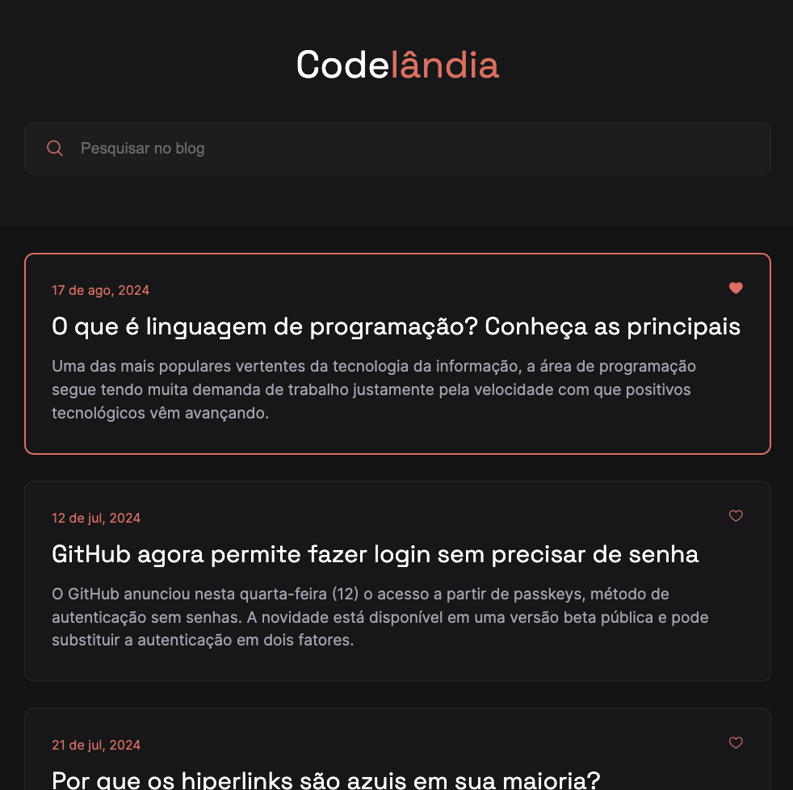
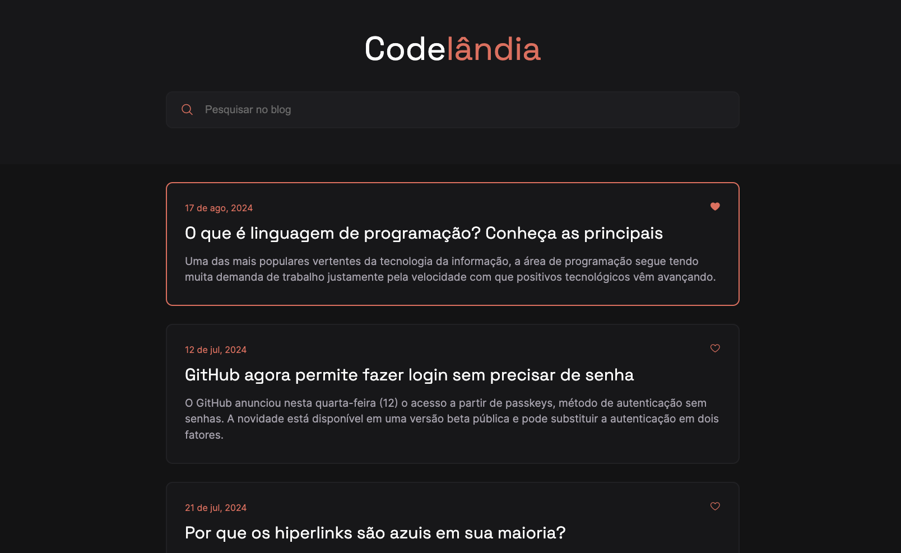

# Blog CODELANDIA

Desafio frontend do repositório [desafios-frontend](https://github.com/iuricode/desafios-frontend), usando HTML e css.

Este projeto chama-se **Codelância** e o link para o design no Figma pode ser conferido [aqui](https://www.figma.com/file/Yb9IBH56g7T1hdIyZ3BMNO/Desafios---Codel%C3%A2ndia?type=design&node-id=0-1&mode=design).

## Screenshots

### Mobile

### Tablet

### Desktop

